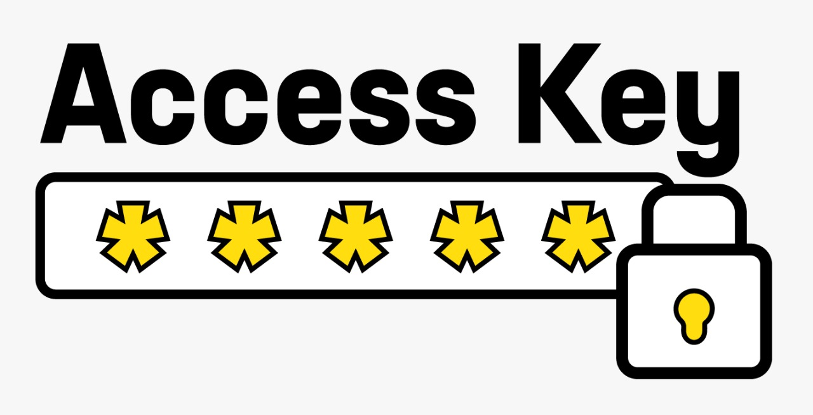

 Accenture Brasil - Academia Java Fast_Projeto Final

<Logo com o nome da empresa com fundo branco>

### A API de Geração e Gerenciamento de Tokens da Accenture Brasil

## Status do projeto:

**Finalizado**

=================

<!--ts-->

- [Objetivo e Motivação](#objetivo-e-motivação)
- [Tecnologias](#tecnologias)
- [Escolhas das tecnologias](#escolhas-das-tecnologias)
- [Maior desafio](#maior-desafio)
- [Maior aprendizado](#maior-aprendizado)
- [Possíveis mudanças](#possíveis-mudanças)
- [Funcionalidades](#funcionalidades)
  - [Próximas features](#próximas-features)
  - [Como usar](#como-usar)
- [Referências](#referências)
- [Agradecimentos](#agradecimentos)
- [Autoras](#autoras)
- [Licença](#licença)
<!--te-->

=================

## Objetivo e motivação:

> Para este projeto, o objetivo principal está em desenvolver uma API para Gerar e Gerenciar tokens. Como requsisito, a API segue o padrão REST, contendo os seguintes métodos: cadastro, alteração, remoção e consulta de tokens, além do método para Gerar os tokens que serão as chaves de acesso e manipulação principal das funcionalidades.
> Importante salientar que para Gerar os Tokens faz-se necessário utilizar o Base64 para codificar o escopo inicial de geração. 
> Motivadas pelo aprendizado e possível contratação, o grupo se empenhou a entender o funcionamento do sistema e aplicar o que foi aprendido na academia para concretizar a solicitação do cliente. 

## Tecnologias:

- [Java 8](https://www.java.com/en/download/java8_update.jsp)
- [Springboot Framework](https://spring.io/projects/spring-boot)
- [Spring Tools Suíte](https://spring.io/tools)
- [Eclipse IDE](https://www.eclipse.org/ide/)
- [Maven](https://maven.apache.org/)
- [Postman](https://app.getpostman.com/app/download/win64)

## Escolhas das tecnologias

> As tecnologias utilizadas neste projeto seguem o padrão de desenvolvimento de projetos backend em Java empregado pela empresa Accenture Brasil.
> Fez-se necessário adicionar algumas dependências, são elas:
> 1. Spring Boot Web;
> 2. JPA
> 3. H2

## Maior desafio

> De início, alguns podem pensar que o trabalho em grupo reunindo pessoas que se conhecem há pouco tempo será o principal desafio. Errado! O grupo é coeso, coerente e participativo. Cinco mulheres que parecem se conhecer há anos, a sororidade reina e a sintonia foi muito fácil de se estabelecer.
> Os códigos foram desenvolvidos em grupo, para que todas pudessem acompanhar o processo de desenvolvimento de cada uma e entender cada funcionalidade desenvolvida. Além disso, tentou-se prezar pelo código mais homogêneo. 
> No entanto, encontramos como dificuldade o fato de saber pouco ou quase nada da linguagem a ser utilizada. Isso nos fortaleceu a tentar desenvolver e buscar conhecimento além do que foi dado na Academia, nos forçou de forma positiva a pesquisar e pensar "fora da caixa".

## Maior aprendizado

> Sabemos que estamos apenas no início e temos muito o que aprender, mas um dos maiores aprendizados foi o fato de descobrirmos que mesmo com o conhecimento básico de uma linguagem, mas aliado ao conhecimento de lógica de programação, pesquisa e um pouco de orientação, podemos realizar trabalhos. E mais, conseguimos nos testar e perceber como funciona nosso coeficiente de aprendizado. Como iniciantes e bem orientadas, podemos sim realizar muitos trabalhos. 

## Possíveis mudanças

> No que diz respeito ao desenvolvimento do projeto, teríamos nos concentrado em executar o case literalmente como estava escrito, sem imaginar outras funcionalidades. Pensar além, no nosso caso, atrapalhou nosso entendimento. 
> Por outro lado, assim que focamos nosso olhar o traballho fluiu.
> 
> Quanto ao Case Gerenciamento, acreditamos que poderíamos ter um método de login para simular o consumo da API tanto pelo Cliente quanto pelo Servidor.

## Funcionalidades:

### Gerenciando Tokens

---

| Verbo    | Recurso                  | Descrição                                       |
| -------- | ------------------------ | ----------------------------------------------- |
| 1.POST   | `/gerarToken`            | Gerar token para uso                            |
| 2.GET    | `/usarToken`             | Retornar tokens gerados para uso                |
| 3.GET    | `/validarToken`          | Validação do token                              |
| 4.PUT    | `/reativarTokenExpirado` | Reativar o token expirado                       |
| 5.DELETE | `/excluirToken`          | Excluir token                                   |

Funcionalidade adicional:

| Verbo    | Recurso                  | Descrição                                       |
| -------- | ------------------------ | ----------------------------------------------- |
| 1.GET    | `/buscarToken`           | Lista todos os tokens gerados                   |
---

### **Próximas features**:

> Reafatorar o código e deixar o tratamento de erro em uma arquivo específico;
> Um GET com validação para buscar todos os POSTs que estão no banco, mas mostrando um tratamento de erro, caso o banco esteja vazio.
> Retornar as mensagens referentes às responses de cada método.

### **Como usar**:

> Para usar o projeto, seguir os passos:
>1. Abra a pasta do projeto CaseToken, em sua IDE de preferência. lembre-se que ao usar alguma diferente da utilizada, pode haver necessidade de instalar plugins para usar o Java;
>2. Após abrir em sua IDE, só executar o servidor. Para este projeto colocamos a porta 8084 como default, mas para alterar basta acessar o pacote src/main/resources e reconfigurar o arquivo **application.properties**;
>3. Feito isso, abra o Postaman para teste das rotas. Os teste do funcionamento da API podem ser feitos pelo Postman ou qualquer aplicativo para testes de API.
>4. A seguir deixamos telas dos testes realizados e os principais retornos após as requisições.

## Referências:

> 1. Base Encode. Disponível em: https://www.base64decode.org/.
> 2. Criação de API Rest com Spring Boot. Disponível em: https://www.treinaweb.com.br/blog/criando-uma-api-rest-com-o-spring-boot/.
> 3. Base64. https://dicasdejava.com.br/java-como-encriptar-e-desecriptar-uma-string-em-base64/.
> 4. Escolha uma licença. http://escolhaumalicenca.com.br/licencas/.
> 5. Para usar o PathVariable = https://www.baeldung.com/spring-requestparam-vs-pathvariable.
> 6. Uso do Optional e o isPresent: https://docs.oracle.com/javase/8/docs/api/java/util/Optional.html
> 7. Cálculo do tempo da Requisição. https://www.ti-enxame.com/pt/date/como-calcular-diferenca-de-horario-entre-duas-datas-usando-localdatetime-em-java-8/833280341/
> 8. Usando o try/catch: https://howtodoinjava.com/java/exception-handling/try-catch-finally/
> 9. Gerando o Token. Baseado em: https://www.baeldung.com/java-random-string#java8-alphanumeric
> 10. Licença MIT. Dísponível em: http://escolhaumalicenca.com.br/licencas/mit/#

## Agradecimentos:

> Agradecemos a oportunidade de participar da Java Fast Academy. Aqui encontramos um ambiente seguro e confortável de aprendizado e desenvolvimento de nossas skills.
> Nosso agradecimentos aos mentores que estavam presentes nas aulas, Artur Oliveira, Alisson Raniel, Douglas Santos, tirando dúvidas, ajudando com o entendimento dos cases e da linguagem.
> Agradecimento mais que especial ao nosso instrutor e facilitador, Samuel Bataglião  que conduziu as aulas com tranquilidade e paciência, pelas dicas e conhecimento, nossa gratidão.
> Ao Francisco Sousa e ao Evandro Mirres, por acreditarem em nosso desenvolvimento de competências e aprendizado, que poderíamos seguir: Muita gratidão. 
> Accenture Brasil, obrigada por proporcionar um caminho para muitos iniciantes ingressarem na carreira de tecnologia.

---

## Autoras

---

  
  
  
  
  

---
Feito com 💜

## Licença

Este projeto está sob a licença 

